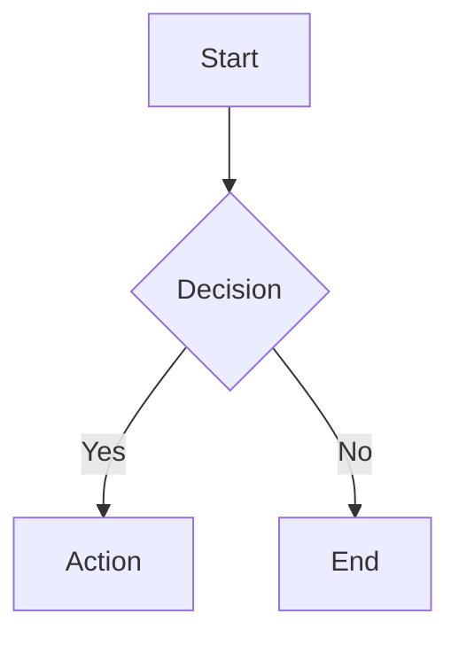

# Documentation Guidelines

This document outlines the standards and practices for maintaining project documentation.

## 📁 Documentation Location

**All project documentation MUST be placed in the `PMdocs/` folder.**

## 📝 File Naming Conventions

### General Rules
- Use UPPERCASE for all documentation filenames
- Use underscores `_` to separate words
- Use `.md` extension for markdown files
- Be descriptive and specific

### Categories and Naming Patterns

| Category | Pattern | Example |
|----------|---------|---------|
| Architecture | `ARCHITECTURE_*.md` | `ARCHITECTURE_DATABASE.md` |
| API Documentation | `API_*.md` | `API_AUTHENTICATION.md` |
| Module Documentation | `MODULE_*.md` | `MODULE_DISPATCH.md` |
| Development Notes | `NOTES_*.md` | `NOTES_TYPESCRIPT_SETUP.md` |
| Update Logs | `UPDATE_*.md` | `UPDATE_2025-11-03.md` |
| Meeting Notes | `MEETING_YYYY-MM-DD.md` | `MEETING_2025-11-03.md` |
| Implementation Guides | `GUIDE_*.md` | `GUIDE_DEPLOYMENT.md` |
| Technical Specs | `SPEC_*.md` | `SPEC_WEBSOCKET.md` |

## 📋 Required Sections

Every documentation file should include:

### 1. Header
```markdown
# Document Title

**Purpose**: Brief description of what this document covers
**Last Updated**: YYYY-MM-DD
**Author**: Name or Team
```

### 2. Table of Contents (for long docs)
```markdown
## Table of Contents
- [Section 1](#section-1)
- [Section 2](#section-2)
```

### 3. Content
- Clear, concise explanations
- Code examples where applicable
- Visual diagrams for complex concepts
- Links to related documentation

### 4. Footer
```markdown
---
**Related Documents**:
- [ARCHITECTURE.md](./ARCHITECTURE.md)
- [API_*.md](./API_*.md)

**Last Updated**: November 3, 2025
```

## ✅ Documentation Checklist

Before committing documentation:

- [ ] File is in `PMdocs/` folder
- [ ] Filename follows naming conventions
- [ ] Document has proper header
- [ ] Content is clear and well-structured
- [ ] Code examples are tested
- [ ] Links to other docs are valid
- [ ] Updated `INDEX.md` with new file
- [ ] Added "Last Updated" date

## 🚫 What NOT to Document Here

**Do NOT place these in PMdocs:**
- `node_modules/` README files (auto-generated)
- Build artifacts
- Temporary notes in code comments
- IDE-specific configurations
- Personal notes (use separate location)

## 📦 Special Files

### Core Documents (Always Keep Updated)

1. **INDEX.md** - Documentation directory
2. **README.md** - Project overview
3. **ARCHITECTURE.md** - System architecture
4. **PROJECT_STATUS.md** - Current progress
5. **BACKEND_README.md** - Backend documentation
6. **FRONTEND_README.md** - Frontend documentation

### Configuration Files

- **docker-compose.yml** - Infrastructure setup (kept for reference)

## 🔄 Update Workflow

### For New Features
1. Create implementation notes: `NOTES_FEATURE_NAME.md`
2. Update relevant existing docs
3. Add entry to `INDEX.md`
4. Update `PROJECT_STATUS.md` if needed

### For Bug Fixes
1. Document in `UPDATE_YYYY-MM-DD.md` or create issue log
2. Update relevant technical specs if needed

### For Architecture Changes
1. Update `ARCHITECTURE.md`
2. Create detailed spec: `SPEC_CHANGE_NAME.md`
3. Update `INDEX.md`

## 📊 Documentation Types

### 1. Technical Architecture
- System design decisions
- Database schemas
- API specifications
- Infrastructure setup

### 2. Implementation Guides
- Step-by-step instructions
- Setup procedures
- Deployment guides
- Troubleshooting

### 3. API Documentation
- Endpoint descriptions
- Request/response examples
- Authentication details
- Error codes

### 4. Development Notes
- Implementation decisions
- Technical challenges solved
- Performance optimizations
- Security considerations

### 5. Project Management
- Status updates
- Roadmap changes
- Meeting summaries
- Decision logs

## 🎨 Markdown Best Practices

### Formatting
```markdown
# Main Heading (H1)
## Section Heading (H2)
### Subsection (H3)

**Bold** for emphasis
*Italic* for terms
`code` for inline code

\`\`\`language
code blocks
\`\`\`
```

### Code Blocks
Always specify language:
````markdown
```typescript
const example: string = "code";
```

```bash
npm install
```

```json
{ "key": "value" }
```
````

### Links
- Relative links: `[Other Doc](./OTHER_DOC.md)`
- External links: `[NestJS](https://nestjs.com/)`
- Anchors: `[Section](#section-name)`

### Images
```markdown

```

## 📐 Diagrams

Use one of:
- **Mermaid** (inline diagrams)
- **ASCII art** (for simple diagrams)
- **PNG/SVG** (for complex diagrams in `PMdocs/images/`)

Example Mermaid:
````markdown

````

## 🔍 Review Process

1. **Self-Review**: Check spelling, grammar, formatting
2. **Technical Accuracy**: Verify code examples work
3. **Completeness**: All sections filled
4. **Links**: All internal/external links work
5. **Index Update**: Added to `INDEX.md`

## 📅 Maintenance Schedule

- **Weekly**: Review and update `PROJECT_STATUS.md`
- **After Major Features**: Update architecture and module docs
- **Monthly**: Review all docs for accuracy
- **Release**: Update version numbers and dates

## 🎯 Goals

Our documentation should be:
- **Accurate**: Always up-to-date with code
- **Complete**: Covers all aspects
- **Clear**: Easy to understand
- **Accessible**: Well-organized and searchable
- **Maintainable**: Easy to update

---

**Last Updated**: November 3, 2025
**Maintained By**: Development Team
